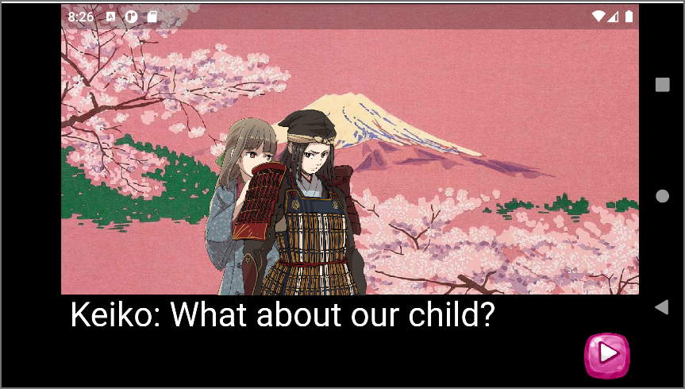
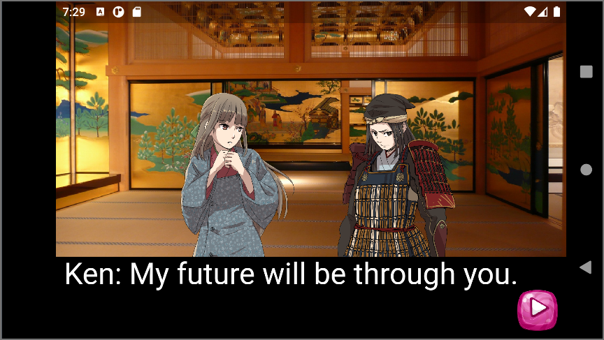

# Flutter Flame Introduction 2022

https://youtube.com/playlist?list=PLxvyAnoL-vu6WtCSTlNXaJLx0Pgscq4-D

Scene 1 - dialog automatically changes



Scene 2 - dialog changes with button press



## ToDo

Add color to TextPaint to display properly on web.

```dart
TextPaint textPaint =
      TextPaint(style: const TextStyle(fontSize: 36, color: Colors.white));
```

## Credits

* CarlMary character graphics - https://carlmary.jp/gallery/materials-300/ - licensed under [CC BY 4.0](https://creativecommons.org/licenses/by/4.0/) - Creative Commons Attribution
* GameArt2d icon buttons - https://www.gameart2d.com/freebies.html - licensed under [CC0 1.0 Universal - Creative Commons Zero](https://creativecommons.org/publicdomain/zero/1.0/)
* Samurai on battlefield
A samurai standing on the lap of a great, outdoor stone statue of the King of Hell, fighting off a mob of assailants. Colour woodcut by Yoshitora, 1843/1846. Created 1843/1846. Samurai. Contributors: Yoshitora Utagawa (active 1850–1870). Image of woodcut under Creative Commons Attribution CC BY 4.0
